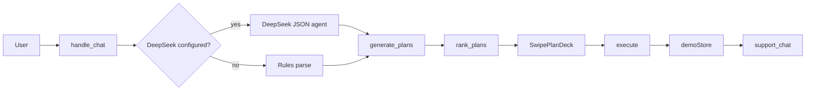

# Cultra — Design Document

**Meituan AI Hackathon · Shenzhen outing planner**  
Brand: `#FFC300` / `#FFFFFF` / `#333333`

---

## 1. Planning strategy

Cultra treats user input as a **goal**, not a keyword search. The system parses intent, searches mock Shenzhen venues, ranks combinations, and returns up to three swipeable plans—or a full multi-stop itinerary.

### Intent parsing (DeepSeek LLM + rules)

| Layer | When | Role |
|-------|------|------|
| **DeepSeek agent** (`llm/agent.ts`) | API key configured in `.env.local` | JSON decision: `action` + structured `intent` (scenario, cuisines, party size, reserve time, quiet dining, delivery add-ons, full-day patterns, invites) |
| **Rules fallback** (`parse_intent.ts`) | No key or LLM error | Regex/keyword parsing; same `ParsedIntent` shape |

The app calls **DeepSeek** (`deepseek-chat`) via the OpenAI-compatible `/v1/chat/completions` API. Env vars are named `OPENAI_*` in code for that client shape—not because OpenAI is the provider.

Post-processing always runs on both paths: `finalizeOutingPlanIntent`, `syncReserveTimeFromUserText` (user clock time beats LLM hints), `inferTimeOfDayFromClock`, and delivery-kind extraction.

**Budget** defaults from the user’s last five same-scenario purchases (±40% per person). Price tiers (cheap / medium / expensive) override. Quick-lunch phrases tighten distance (2 km) and prep time (&lt;15 min).

**Party size** from explicit counts (“party of 4”), family wording, or LLM extraction.

**Quiet dining** sets `quietAmbiance` → restaurants with `reservationLoad > 55%` are filtered out; ranking boosts low-load venues.

**Friends scenario** calls `fetch_friend_history()`: purchase history only for **mutual** friends; favorites and check-ins always apply.

### Plan generation modes

**Simple combos** — Up to three unique activity + restaurant pairs from filtered pools → `check_queue_status` per restaurant → `rank_plans` → optional delivery add-ons → one-stop preview.

**Full itinerary** (`wantsFullItinerary`) — `build_itinerary_plans()` builds 2–3 stops with patterns (`activity_first`, `restaurant_activity_restaurant`, etc.), travel steps, cost summary, and `splitBillEligible` when ≥2 paid stops.

### Ranking (`rank_plans.ts`)

| Weight | Signal |
|--------|--------|
| 30% | Distance from user / district anchor |
| 55% | Cuisine match, diet, price tier, friend history, quiet / reservation load |
| 15% | Queue wait (worst restaurant stop in plan); 20+ min penalized, seats-available boosted |

### Search widen (when pools are empty)

| Failure | Fallback |
|---------|----------|
| No activities | Afternoon pool @ 15 km; full-day @ 20 km |
| No restaurants | Drop cuisine / diet / quiet filters, 15–20 km, rating ≥ 3.5 |
| Strict district + empty | No widen — user prompted to try another district |

---

## 2. Tool call chain

### Planner chat — `POST /api/plans` → `handle_chat.ts`

```
User messages + ChatContext (hasPlans, lastPlans, chosenPlan, planAccepted, acceptedOrderId)
  → analyzeWithLlm  [or analyzeWithRules on miss]
  → ParsedIntent + action (converse | cuisine_info | show_plans | execute | invite_friends)
  → Post-process intent (time, reserve time, delivery kinds, finalize outing)
  → [early] Delivery add-on?  → applyDeliveryAddonsFromMessage → update plan / order
  → [early] Contingency?      → plan_contingency → return updated plan
  → [early] Invite?             → invite_friends → ActivityRoom
  → Branch on action:
       converse      → reply only
       cuisine_info  → listNearbyCuisines + top venues
       execute       → auto acceptPlan (reserve | order) when plans on screen
       show_plans    → generate_plans()
```

**`generate_plans()` chain:**

```
parse_conversation / provided intent
  → fetch_friend_history          [friends scenario]
  → search_activities             [+ preference filters]
  → search_restaurants
  → [widen pools if empty]
  → build_itinerary_plans  OR  buildUniqueCombos (≤3)
  → check_queue_status            [per restaurant]
  → rank_plans
  → attachDeliveryAddonsToPlan
  → attachOneStop                 [execute_one_stop previewOnly]
```

### Plan acceptance — `POST /api/execute`

```
User swipes / confirms
  → acceptPlan (order | reserve | share_only) → createOutingOrder in demoStore
  → send_plan_message(plan, recipients)
  → execute_one_stop(intent, plan)   [reservation / traffic / reminder — confirmed]
```

### Order support — `POST /api/order` action=chat → `replyToOrderSupport`

```
tryApplyDeliveryAddonsToOrder   [rules — syncs plan on order]
  → tryApplyContingency         [rules — rain / swap / crowd]
  → replyWithLlm                [if DeepSeek configured]
  → getOrderChatReplyRules      [fallback]
```

### Shortcuts

- **Nearby cards** (`GET /api/nearby`) — 3 general + 3 nationality-matched restaurants; tap → `plansFromRestaurantIds` without full chat.
- **Profile nation** — drives nationality column on planner nearby panel.



---

## 3. Exception handling

| Case | Mechanism |
|------|-----------|
| **Rain / bad weather** | `weather_activity` contingency → swap outdoor stop for indoor same district |
| **Crowd / long queue / sold out** | `restaurant_issue` → same-cuisine nearby alternative |
| **Explicit swap** | `swap_restaurant` / `swap_activity` → backup search in plan district |
| **No backup found** | User-facing message; suggest different district or cuisine |
| **No venues match filters** | Widen search (see §1); zero plans → cuisine list or district hint |
| **Unknown / non-mutual friend** | Empty purchase history; favorites still used |
| **No API key / DeepSeek unreachable** | Full rules mode; planner shows “basic mode” notice |
| **DeepSeek timeout / error** | Silent fallback to rules (planner + support chat) |
| **Delivery add-on, no restaurant** | Prompt to pick a plan with a dining stop first |
| **One-stop without reserve** | Only runs blocks present in `intent.oneStop` (traffic / reminder optional) |
| **No active order** | Orders page directs user to planner |

Contingencies run in **planner chat** (on existing plan context) and **order support chat** (syncs `order.plan` via `syncOrderFromPlan`). All queue times, traffic ETAs, reservations, and rider positions are **mocked**. State lives in `demoStore` (`globalThis.__cultraStore`) for the server session.

---

## 4. Features & UI map

| Feature | Surface | Backend |
|---------|---------|---------|
| **Planner chat** | `/planner` | `handle_chat` + DeepSeek / rules |
| **Swipe plan deck** | Planner | ≤3 ranked plans; right = reserve/share |
| **Full-day itinerary** | Planner | Timeline, travel, costs, district label |
| **One-stop setup** | Planner banner | Table + traffic + reminder preview |
| **Auto book from chat** | Planner | `action=execute` → `acceptPlan` |
| **Nearby restaurants + activities** | Planner sidebar | `/api/nearby` (general + nationality restaurants + nearby activities) |
| **Delivery add-ons** | Planner chat + Orders support | cake, flowers, champagne, gift, balloons → restaurant |
| **Party size & reserve time** | Plans, one-stop, Orders | `resolveRestaurantReserveTime`, `syncReserveTimeFromUserText` |
| **Quiet / reservation load** | Search filter + ranking | Per-venue `reservationLoad` 0–100 |
| **Split bill** | Planner deck + Orders | Multi-stop outings; delivery order split |
| **Friend invites** | Chat + `/friends` | Activity/restaurant rooms, invitations |
| **Friends social** | `/friends` | Add by ID, pending friend requests, favorites, “friends also want”, circle popular, recs, profile drill-down |
| **Orders & tracking** | `/orders` | Delivery map + ETA; reservation view; outing plan detail |
| **Support chat** | Orders detail | Contingencies, add-ons, DeepSeek Q&A on active order |
| **Profile** | `/profile` | Nation edit → nearby personalization |
| **Landing marketing page** | `/` | Product intro + CTA into planner workflow |
| **Data catalog** | `/data` | Browse all mock restaurants & activities |
| **Admin data inspector** | `/admin` | Search/filter venue catalog quality and metadata |

### LLM configuration (DeepSeek)

Production setup uses **DeepSeek**, not OpenAI. The HTTP client (`llm/client.ts`) speaks the OpenAI-compatible chat-completions protocol, so configuration reuses `OPENAI_*` env names.

| Variable | Production value | Purpose |
|----------|------------------|---------|
| `OPENAI_API_KEY` | DeepSeek API key | Enables LLM; absence = rules-only |
| `OPENAI_BASE_URL` | `https://api.deepseek.com/v1` | DeepSeek endpoint |
| `OPENAI_MODEL` | `deepseek-chat` | Planner JSON agent + support text chat |

Example `.env.local`:

```
OPENAI_API_KEY=sk-...
OPENAI_BASE_URL=https://api.deepseek.com/v1
OPENAI_MODEL=deepseek-chat
```

**Two DeepSeek surfaces:** planner JSON agent (`llm/agent.ts`, `response_format: json_object`) and order support text chat (`llm/support_chat.ts`). Search, rank, contingencies, delivery attachment, invites, and store writes are always deterministic rules.

### Data layer

Mock catalogs: `restaurants.ts` (~43 venues, districts, `reservationLoad`), `activities.ts`, `users.ts`, `delivery_vendors.ts`, `districts.ts`. `demoStore` holds orders (`order` | `reservation` | `outing`), split bills, rooms, invitations, and `activeOutingPlan`. No external DB.
